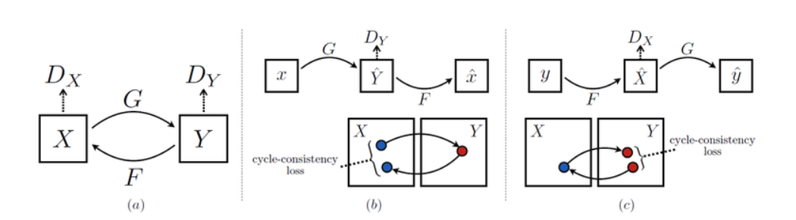
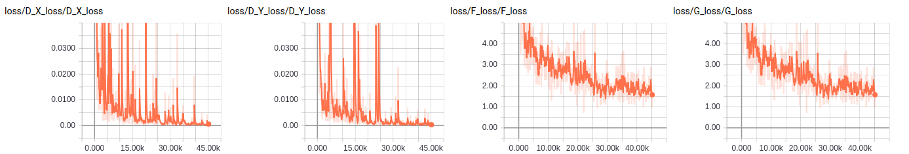
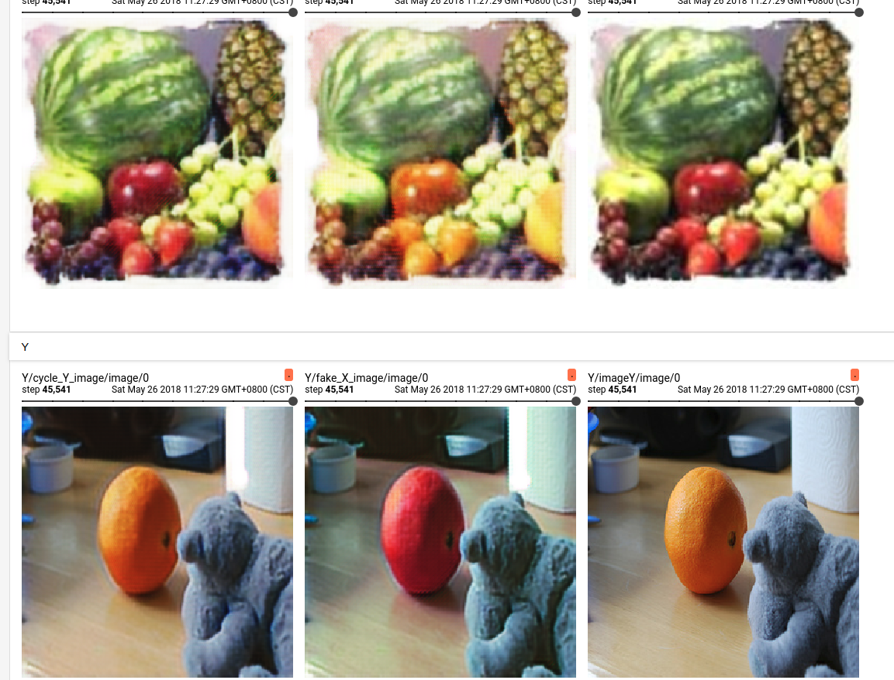

# cycleGAN

TensorFlow implementation of [Unpaired Image-to-Image Translation using Cycle-Consistent Adversarial Networks](https://arxiv.org/pdf/1703.10593.pdf). (2017. 3)



## Requirements

- Python 3
- TensorFlow 1.5


## Project Structure


    ├── config                  # Config files (.yml)
    ├── data                    # dataset path
    ├── architecture            # architecture graphs
        ├── __init__.py             # Network
    ├── data_loader.py          # raw_data -> processed_data -> generate_batch
    ├── main.py                 # train and evaluate
    ├── utils.py                # config tools 
    └── model.py                # define model, loss, optimizer
    

## Config

example: cycleGAN.yml

```yml
data:
  base_path: 'data/'
  data_path: 'apple2orange/'
  processed_path: 'processed_data/'
  imageX_path: 'trainA'
  imageY_path: 'trainB'

model:
  base_generator_filter: 64
  base_discriminator_filter: 64
  image_size: 256
  cycle_loss_weight_X: 10.0
  cycle_loss_weight_Y: 10.0
  real_label: 0.9
  gen_images_buffer_size: 50

train:
  batch_size: 1
  generator_train_step: 1
  model_dir: 'logs/cycleGAN'

  learning_rate: 0.0002
  start_decay_step: 100000
  beta1: 0.5

  max_steps: 200000
  save_checkpoints_steps: 2000
  check_hook_n_iter: 100

  debug: False

predict:
  model: 'G'

```

* `dataset` [download here](https://people.eecs.berkeley.edu/~taesung_park/CycleGAN/datasets/)

## Run

Process raw data

```
python data_loader.py
```

Train

```
python main.py
```


## Tensorboard


Trained for 12hr on one 1070Ti, requires more training.




## Example

Step 45700. Requires more training.


