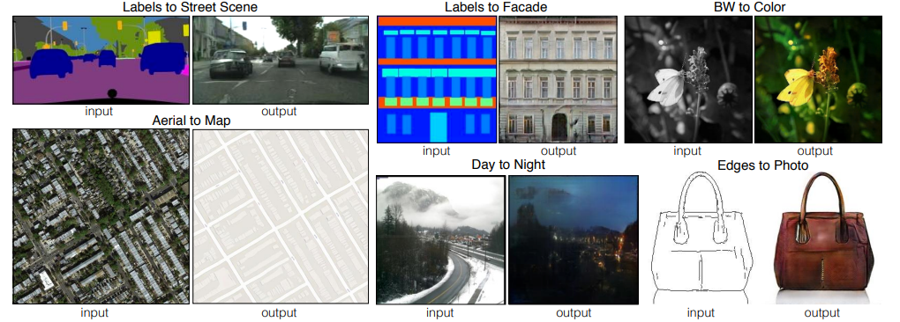
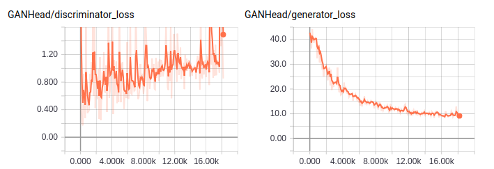
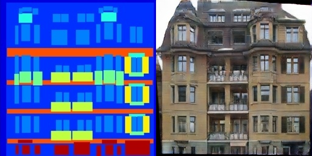
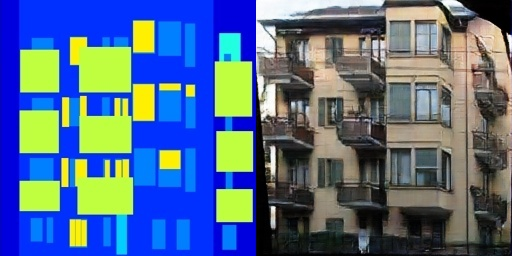

# pix2pix

TensorFlow implementation of [Image-to-Image Translation Using Conditional Adversarial Networks](https://arxiv.org/pdf/1611.07004v1.pdf). (2016. 11)



## Requirements

- Python 3
- TensorFlow 1.5


## Project Structure


    ├── config                  # Config files (.yml)
    ├── data                    # dataset path
    ├── network                 # define network
    ├── data_loader.py          # raw_data -> processed_data -> generate_batch
    ├── main.py                 # train and evaluate
    ├── utils.py                # config tools 
    └── model.py                # define model, loss, optimizer
    

## Config

example: pix2pix.yml

```yml
data:
  base_path: 'data/'
  data_path: 'facades/'
  image_direction: 'BtoA'

model:
  base_generator_filter: 64
  base_discriminator_filter: 64
  image_size: 256
  l1_weight: 100.0

train:
  batch_size: 4
  epoch: 300
  model_dir: 'logs/pix2pix'
  learning_rate: 0.0002
  beta1: 0.5
  G_step: 1

  save_checkpoints_steps: 1000
  check_hook_n_iter: 100

  debug: False
```

* `facades` [download here](https://people.eecs.berkeley.edu/~tinghuiz/projects/pix2pix/datasets/facades.tar.gz)

## Run

Process raw data

```
python data_loader.py --config config/pix2pix.yml
```

Train

```
python main.py --config config/pix2pix.yml
```


## Tensorboard


- pix2pix.yml (trained for 1hr on one 1070Ti)




## Example

　　　　　　　input　　　　　　　　　　　　generate






