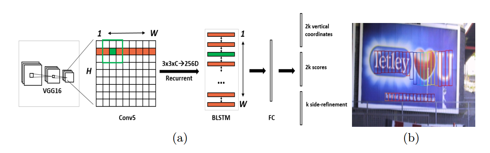

# CTPN

TensorFlow implementation of [Detecting Text in Natural Image with Connectionist Text Proposal Network](https://arxiv.org/pdf/1609.03605.pdf). (2016. 9)



## Requirements

- Python 3.6
- TensorFlow 1.6


## Project Structure


    ├── config                  # Config files (.yml)
    ├── data                    # dataset path
    ├── CTPN                    # CTPN architecture graphs (from input to logits)
        ├── __init__.py             # Graph logic
    ├── data_loader.py          # raw_data -> processed_data -> generate_batch (using Dataset)
    ├── main.py                 # train and evaluate
    ├── utils.py                # config tools 
    └── model.py                # define model, loss, optimizer
    

## Config

example: MLT.yml

```yml
data:
  base_path: 'data/MLT/'
  raw_data_path: 'raw_data/'
  raw_image_path: 'image/'
  raw_txt_path: 'txt/'
  processed_path: 'processed_data/'
  samples_per_tfrecord: 1000
  threshold: 0.5

model:
  lstm_unit: 128
  fc_unit: 512
  anchor_width: 16
  anchor_height: [11,16,23,33,47,67,95,136,194,273]

train:
  num_positive: 64
  num_negtive: 64
  reg_weight: 1.0
  side_weight: 2.0
  max_gradient_norm: 5.0

  learning_rate: 0.001
  learning_decay_steps: 1000
  learning_decay_rate: 0.9
  optimizer: 'Adam'

  max_steps: 50000
  model_dir: 'logs/MLT'

  save_checkpoints_steps: 1000
  check_hook_n_iter: 200

  debug: False
```

* `ICDAR2017-MLT` [download here](http://rrc.cvc.uab.es/?ch=8&com=downloads)

## Run

Process raw data

```
python data_loader.py --config config/MLT.yml
```

Train

```
python main.py --config config/MLT.yml
```