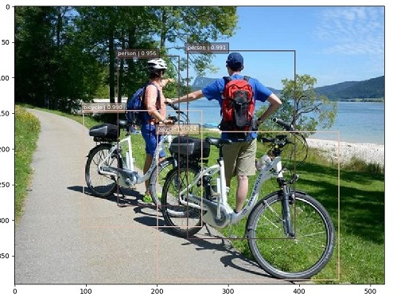

SSD: Single Shot MultiBox Detector in TensorFlow  

[论文地址](https://arxiv.org/pdf/1512.02325.pdf)  

模型核心思路:  
将图片分别划分为六组网格((38*38),(19*19),(10*10),(5*5),(3*3),(1*1))  
以每个网格为中心有4或6个默认框  
图片根据与网格之间的iou转换为目标: 正样本与负样本 正样本包括实物分类与边框偏移值 负样本包括背景分类  
图片通过模型后分别使用六个特征层的输出去拟合目标  

下载[预训练模型](https://drive.google.com/file/d/1eHA6C-R9fCuAQG0d-ohexzF--gVZmify/edit)放在checkpoints下  

main.py: 入口  
model.py: 模型  
trainer.py: 训练
predictor.py: 预测

train  
```bash
python main.py --model=train --dataset_file=xxx.tfrecord
```  



