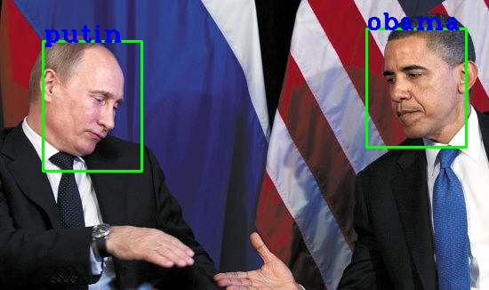
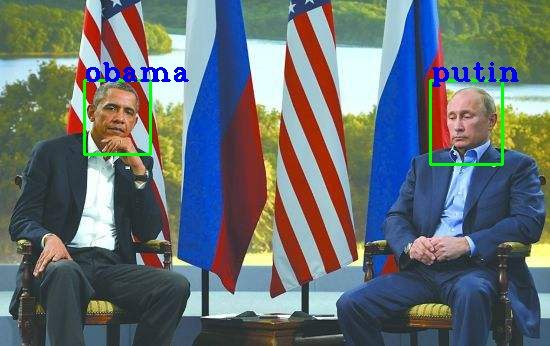

FaceNet: A Unified Embedding for Face Recognition and Clustering in TensorFlow

[论文地址](https://arxiv.org/pdf/1503.03832.pdf)

模型训练流程:   
1.将incept-resnet-v1最后一层改为128个神经元，经过L2-normalizatoin后作为embedding层  
2.从所有图片中随机抽取2000张图片为样本，通过网络计算出embedding  
3.选取满足 dist(a,n) - dist(a,p) < margin 的样本组成triplet, 再次通过网络  
4.loss为 maximum(dist(a,p) - dist(a,n) + margin,0)  

下载[预训练模型](https://drive.google.com/file/d/1nzNJVDKNzNc8Oq4smOFAoQKY8-ZK9uCB/edit) 放在checkpoints下   

main.py: 训练网络入口
predict: 根据embedding训练分类器并识别
align: 将图片中的人脸裁剪出来

train  
```bash
python main.py --data_dir xxx --log_dir xxx ...  
```   

predict  
```bash
python predict.py --mode CLASSIFY --image_files [...] ...  
```   



