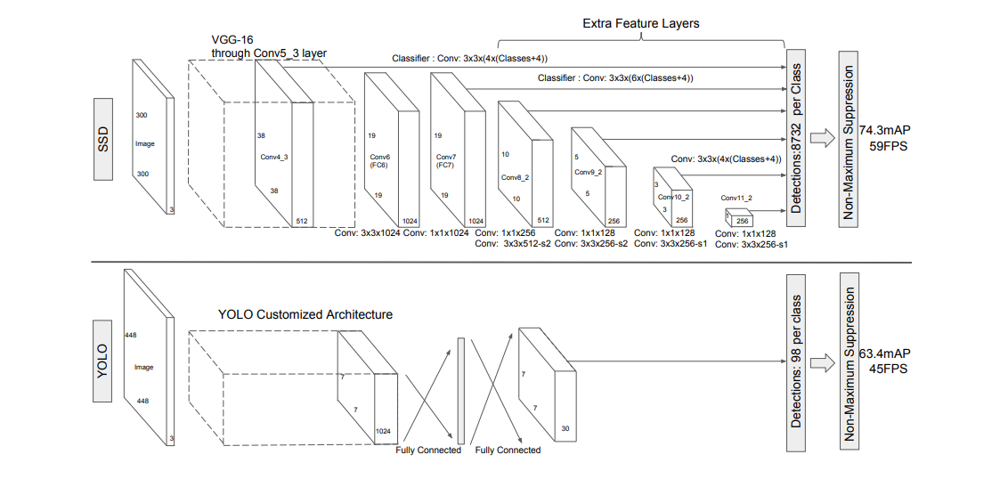
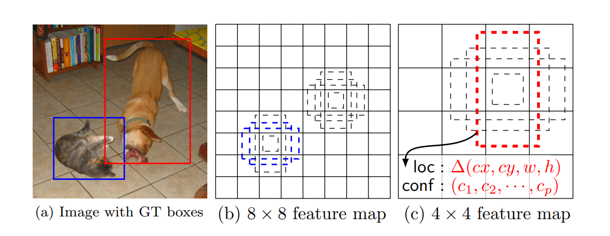
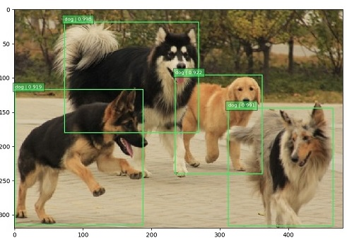
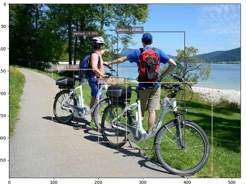
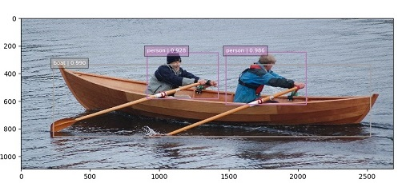

# SSD 

TensorFlow implementation of [SSD: Single Shot MultiBox Detector](https://arxiv.org/pdf/1512.02325.pdf). (2015. 12)





## Requirements

- Python 3.6
- TensorFlow 1.6


## Project Structure


    ├── config                  # Config files (.yml)
    ├── data                    # dataset path
        ├── logs                    # checkpoints
    ├── SSD                     # SSD architecture graphs (from input to logits)
        ├── __init__.py             # Graph logic
    ├── data_loader.py          # raw_date -> precossed_data -> generate_batch (using Dataset)
    ├── main.py                 # train
    ├── predict.py              # predict
    ├── visualization.py        # show result
    ├── utils.py                # config tools
    └── model.py                # define model, loss, optimizer
    

## Config

example: voc2007.yml

```yml
data:
  base_path: 'data/'
  raw_data_path: 'VOC2007'
  processed_path: 'processed_VOC2007'
  directory_annotations: 'Annotations/'
  directory_images: 'JPEGImages/'
  samples_per_tfrecord: 1000
  num_classes: 21
  voc_labels:
    none: 0
    aeroplane: 1
    bicycle: 2
    bird: 3
    boat: 4
    bottle: 5
    bus: 6
    car: 7
    cat: 8
    chair: 9
    cow: 10
    diningtable: 11
    dog: 12
    horse: 13
    motorbike: 14
    person: 15
    pottedplant: 16
    sheep: 17
    sofa: 18
    train: 19
    tvmonitor: 20

model:
  image_shape: [300,300]
  feat_layers: ["block4", "block7", "block8", "block9", "block10", "block11"]
  feat_shape: [[38, 38], [19, 19], [10, 10], [5, 5], [3, 3], [1, 1]]
  anchor_sizes_bounds: [0.15, 0.90]
  anchor_sizes: [[21, 45],[45, 99],[99,153],[153, 207],[207, 261],[261, 315]]
  anchor_steps: [8, 16, 32, 64, 100, 300]
  anchor_offset: 0.5
  normalizations: [1, -1, -1, -1, -1, -1]
  prior_scaling: [0.1, 0.1, 0.2, 0.2]
  anchor_ratios: [[2,0.5],[2,0.5,3,0.33],[2,0.5,3,0.33],[2,0.5,3,0.33],[2,0.5],[2,0.5]]

  batch_size: 32

train:
  negative_ratio: 3.0
  alpha: 1.0
  learning_rate: 0.001
  learning_decay_steps: 2000
  learning_decay_rate: 0.9
  optimizer: 'Adam'

  max_steps: 100000
  model_dir: 'logs/VOC2007'

  save_checkpoints_steps: 500
  check_hook_n_iter: 100

  debug: False

predict:
  select_threshold: 0.5
  nms_threshold: 0.45
```

* `voc2007` [download here](http://host.robots.ox.ac.uk/pascal/VOC/voc2007/)

## Run

Pre-process raw data

```
python data_loader.py --config config/voc2007.yaml
```

Train

```
python main.py --mode train --config config/voc2007.yaml
```

Predict  
[download pretrained model](https://drive.google.com/open?id=163Y-KPK2b4NrU7XHFGj4ESfZpt_3lKaa)
```
python predict.py --config config/voc2007.yaml --file_names image1.jpg image2.jpg ...
```


## Example








