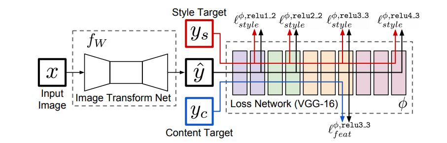
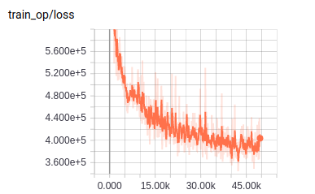

# fast-neural-style

TensorFlow implementation of [Perceptual Losses for Real-Time Style Transferand Super-Resolution](https://arxiv.org/pdf/1603.08155.pdf). (2016. 3)



## Requirements

- Python 3.6
- TensorFlow 1.6


## Project Structure


    ├── config                  # Config files (.yml)
    ├── data                    # dataset path
    ├── architecture            # architecture graphs
        ├── __init__.py             # Graph logic
    ├── data_loader.py          # raw_data -> processed_data -> generate_batch
    ├── main.py                 # train and evaluate
    ├── utils.py                # config tools 
    ├── predict.py              # predict  
    └── model.py                # define model, loss, optimizer
    

## Config

example: COCO.yml

```yml
data:
  style_image: 'images/the_starry_night.jpg'
  base_path: 'data/COCO'
  raw_data_path: 'raw_data'
  processed_path: 'processed_data'
  samples_per_tfrecord: 1000

model:
  batch_size: 4
  image_size: 256
  content_layers:
    - "vgg_16/conv3/conv3_3"
  style_layers:
    - "vgg_16/conv1/conv1_2"
    - "vgg_16/conv2/conv2_2"
    - "vgg_16/conv3/conv3_3"
    - "vgg_16/conv4/conv4_3"
  channels_mean: [123.68, 116.78, 103.94]
  content_weight: 1.0
  style_weight: 250.0
  tv_weight: 0.0

train:
  learning_rate: 0.001

  max_steps: 44000
  model_dir: 'logs/fast-neural-style-tensorflow/the_starry_night'

  save_checkpoints_steps: 4000
  check_hook_n_iter: 100

  debug: False
```

* `COCO` [download here](http://cocodataset.org/#download)

## Run

Process raw data

```
python data_loader.py --config config/COCO.yml
```

Train

```
python main.py --config config/COCO.yml
```

Predict

```
python predict.py --config config/COCO.yml --file xxx1.jpg xxx2.jpg
```

## Tensorboard


- COCO.yml (trained for 4hrs on one 1070Ti)




## Example


